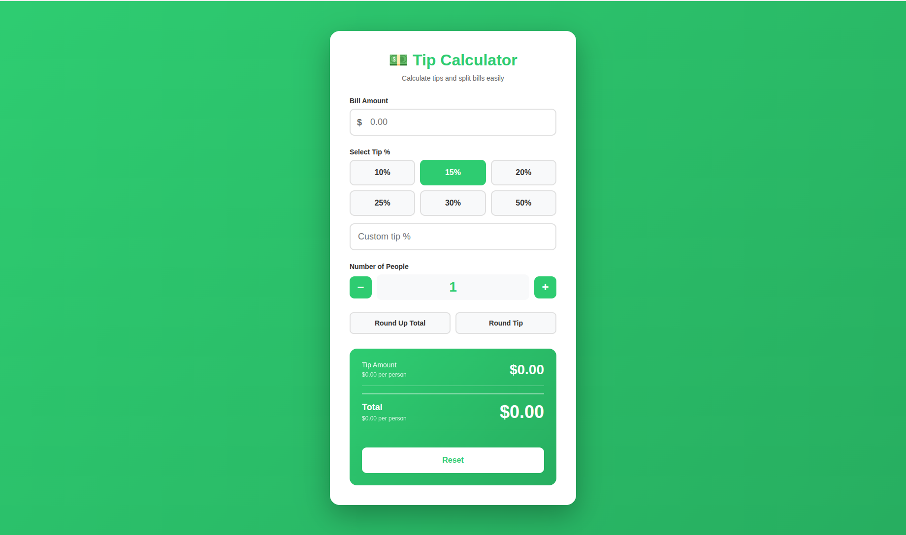
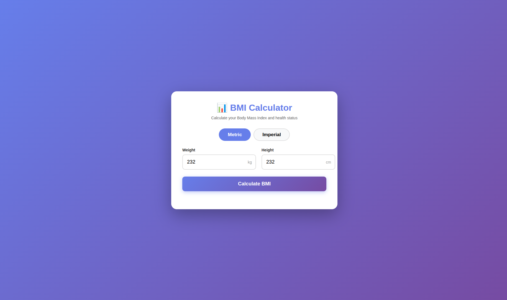
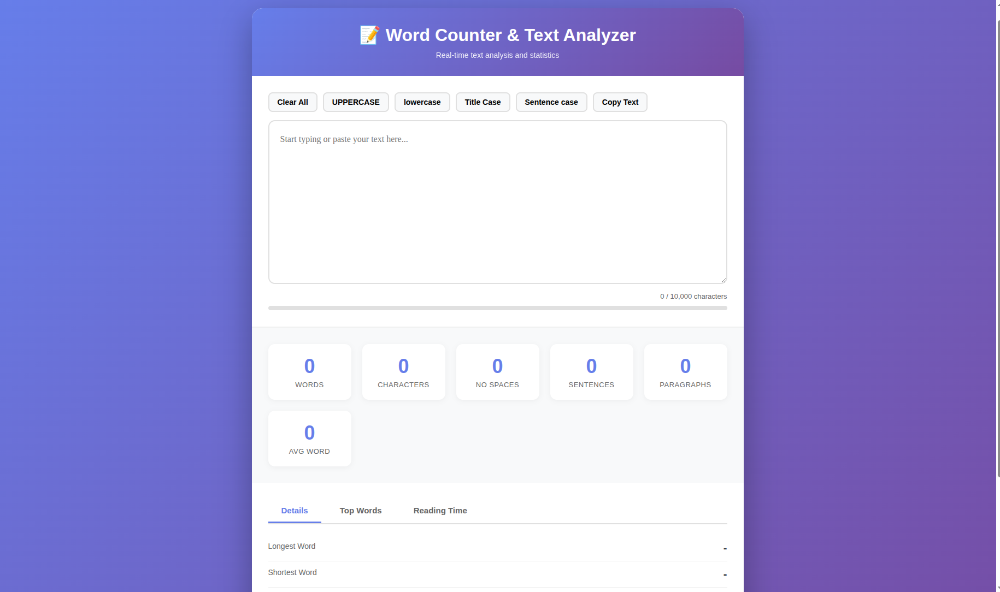
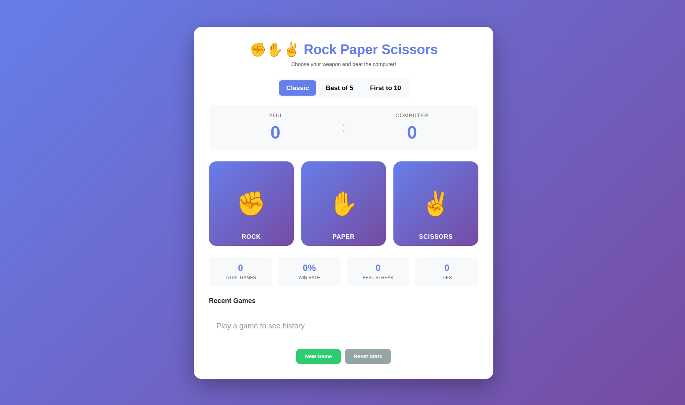
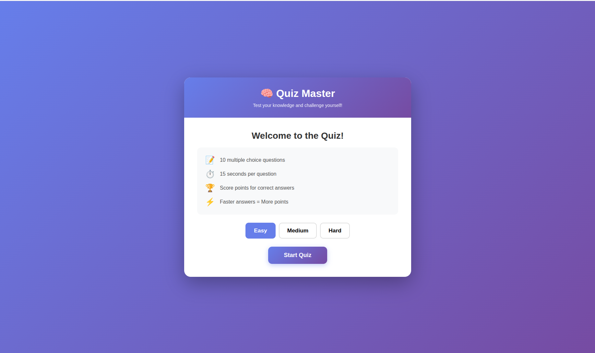

# 📘 Learning JavaScript

---
### What is JavaScript?

JavaScript is a high-level, interpreted programming language used to create interactive, dynamic, and responsive web applications.  

It runs directly in the browser and allows developers to control webpage behavior such as user interactions, data updates, animations, and real-time content changes. 

JavaScript is one of the core web technologies, alongside HTML (structure) and CSS (styling), and is also widely used on the server-side, mobile apps, and desktop applications.  

---

## 🧠 Fundamentals & DOM Basics

---

## 🎂 Age Calculator
**What You’ll Learn:** Variables & operators, DOM manipulation, Date manipulation & calculations, input validation, dynamic UI updates  

📸 **Screenshot**  

<a href="https://pankajsondagar.github.io/javascript/beginner-projects/age-calculator/" target="_blank" rel="noopener noreferrer">
  🚀 Live Demo
</a>

---

## 🌡️ Temperature Converter
**What You’ll Learn:** Real-time updates, temperature conversion formulas, multiple output handling, Functions, conditionals

📸 **Screenshot**  

<a href="https://pankajsondagar.github.io/javascript/beginner-projects/temperature-converter/" target="_blank" rel="noopener noreferrer">
  🚀 Live Demo
</a>

---

## 💬 Random Quote Generator
**What You’ll Learn:** Data collections, random number generation, duplicate prevention, Arrays & objects, random logic, event handling   

📸 **Screenshot**  

<a href="https://pankajsondagar.github.io/javascript/beginner-projects/quote-generator/" target="_blank" rel="noopener noreferrer">
  🚀 Live Demo
</a>

---

## 🎨 Color Flipper
**What You’ll Learn:** HEX/RGB colors, brightness calculation, dynamic style updates, Random color generation, string manipulation,

📸 **Screenshot**  

<a href="https://pankajsondagar.github.io/javascript/beginner-projects/color-flipper/" target="_blank" rel="noopener noreferrer">
  🚀 Live Demo
</a>

---

## 🔢 Simple Counter 
**What You’ll Learn:** State handling, keyboard & button events, animations, increment/decrement logic, conditional styling 

📸 **Screenshot**  

<a href="https://pankajsondagar.github.io/javascript/beginner-projects/simple-counter/" target="_blank" rel="noopener noreferrer">
  🚀 Live Demo
</a>

---

## ✅ Todo List App
**What You’ll Learn:** Task filtering, persistent state, dynamic rendering, Array manipulation, CRUD operations, state management  

📸 **Screenshot**  

<a href="https://pankajsondagar.github.io/javascript/beginner-projects/todo-list/" target="_blank" rel="noopener noreferrer">
  🚀 Live Demo
</a>

---

---

## 🧠 Intermediate Concepts 

---

## 🎂 Password Generator
**What You’ll Learn:** String manipulation and concatenation, Clipboard API for copying text, DOM manipulation and styling  

📸 **Screenshot**  

<a href="https://pankajsondagar.github.io/javascript/intermediate-projects/password-generator/" target="_blank" rel="noopener noreferrer">
  🚀 Live Demo
</a>

---

## 🎂 Tip Calculator
**What You’ll Learn:** Form Handling, Calculations, State Management, DOM Manipulation, UI Patterns, Money Operations   

📸 **Screenshot**  

<a href="https://pankajsondagar.github.io/javascript/intermediate-projects/tip-calculator/" target="_blank" rel="noopener noreferrer">
  🚀 Live Demo
</a>

---

## 🎂 BMI Calculator
**What You’ll Learn:** Validation, Calculations, Conditionals & Ranges, Data Structures, DOM Manipulation, User Experience

📸 **Screenshot**  

<a href="https://pankajsondagar.github.io/javascript/intermediate-projects/bmi-calculator/" target="_blank" rel="noopener noreferrer">
  🚀 Live Demo
</a>

---

## 🎂 Word Counter
**What You’ll Learn:**  String manipulation in depth, Text parsing and analysis, Real-time DOM updates, Frequency counting algorithms, Regular expressions basics, Array transformation methods

📸 **Screenshot**  

<a href="https://pankajsondagar.github.io/javascript/intermediate-projects/word-counter/" target="_blank" rel="noopener noreferrer">
  🚀 Live Demo
</a>

---

## 🎂 Rock Paper Scissors
**What You’ll Learn:** 

📸 **Screenshot**  

<a href="https://pankajsondagar.github.io/javascript/intermediate-projects/rock-paper-scissors/" target="_blank" rel="noopener noreferrer">
  🚀 Live Demo
</a>

---

## 🎂 Quiz App
**What You’ll Learn:**

📸 **Screenshot**  

<a href="https://pankajsondagar.github.io/javascript/intermediate-projects/quiz-app/" target="_blank" rel="noopener noreferrer">
  🚀 Live Demo
</a>

---