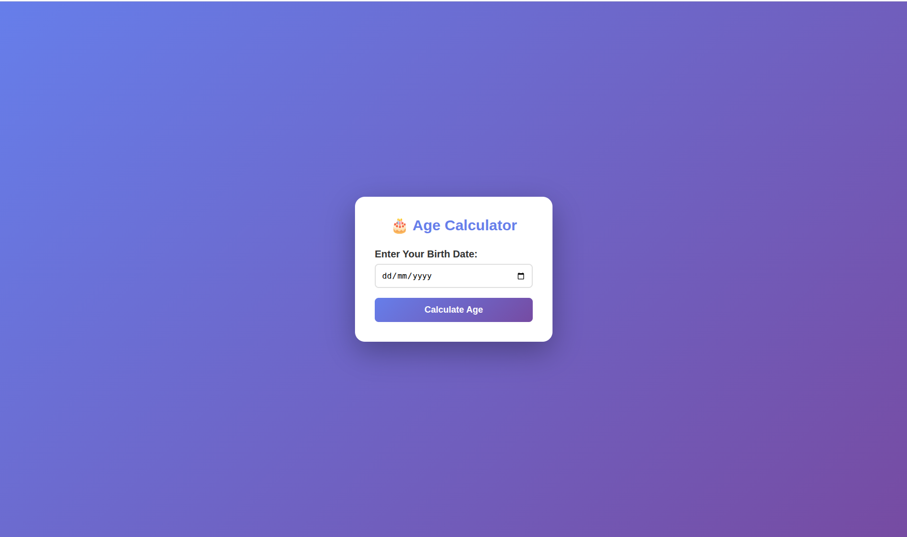
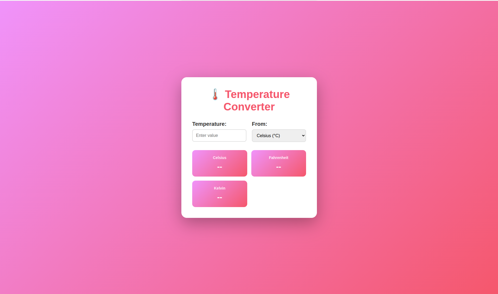
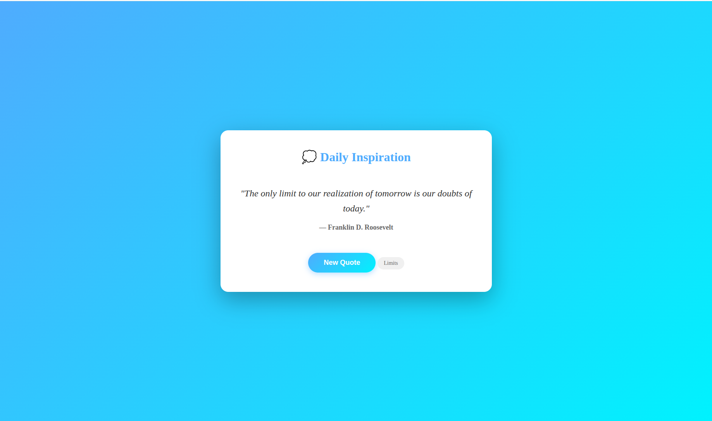
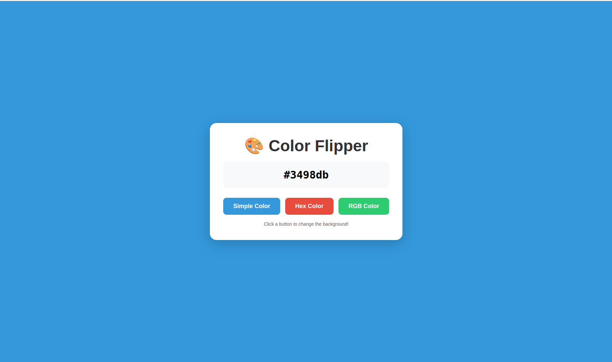
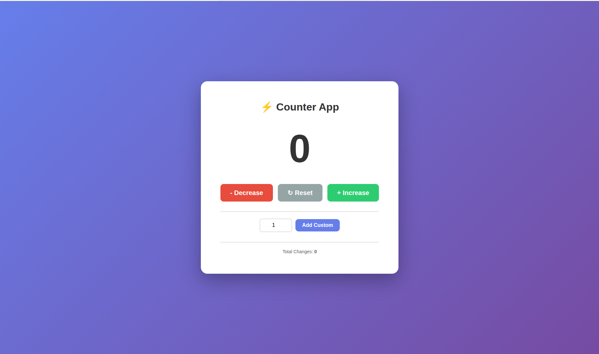
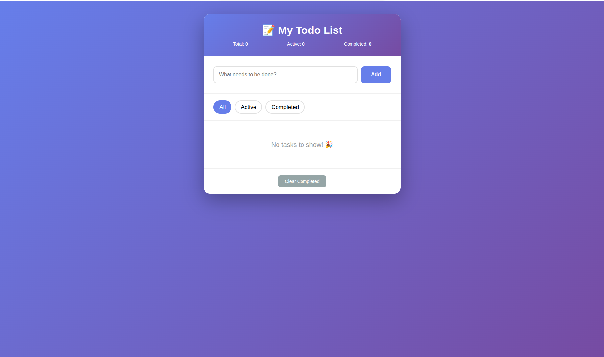
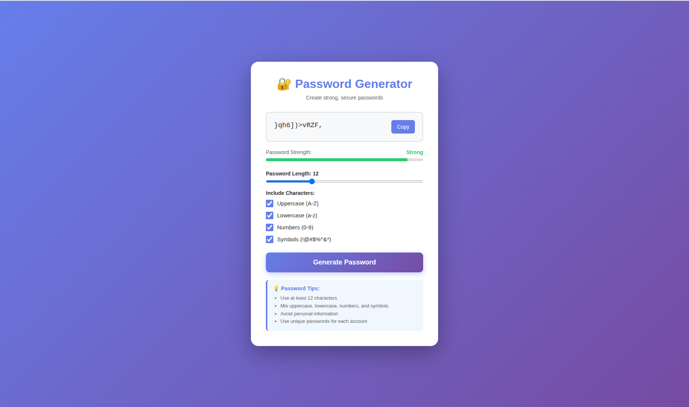

# 📘 Learning JavaScript

---

## 🧠 Fundamentals & DOM Basics

---

## 🎂 Age Calculator
**Skills Used:** Variables & operators, DOM manipulation  
**What You’ll Learn:** Date manipulation & calculations, input validation, dynamic UI updates  

📸 **Screenshot**  

<a href="https://pankajsondagar.github.io/javascript/beginner-projects/age-calculator/" target="_blank" rel="noopener noreferrer">
  🚀 Live Demo
</a>

---

## 🌡️ Temperature Converter
**Skills Used:** Functions, conditionals, multiple input handling  
**What You’ll Learn:** Real-time updates, temperature conversion formulas, multiple output handling  

📸 **Screenshot**  

<a href="https://pankajsondagar.github.io/javascript/beginner-projects/temperature-converter/" target="_blank" rel="noopener noreferrer">
  🚀 Live Demo
</a>

---

## 💬 Random Quote Generator
**Skills Used:** Arrays & objects, random logic, event handling  
**What You’ll Learn:** Data collections, random number generation, duplicate prevention  

📸 **Screenshot**  

<a href="https://pankajsondagar.github.io/javascript/beginner-projects/quote-generator/" target="_blank" rel="noopener noreferrer">
  🚀 Live Demo
</a>

---

## 🎨 Color Flipper
**Skills Used:** Random color generation, string manipulation, dynamic styling  
**What You’ll Learn:** HEX/RGB colors, brightness calculation, dynamic style updates  

📸 **Screenshot**  

<a href="https://pankajsondagar.github.io/javascript/beginner-projects/color-flipper/" target="_blank" rel="noopener noreferrer">
  🚀 Live Demo
</a>

---

## 🔢 Simple Counter
**Skills Used:** State management, increment/decrement logic, conditional styling  
**What You’ll Learn:** State handling, keyboard & button events, animations  

📸 **Screenshot**  

<a href="https://pankajsondagar.github.io/javascript/beginner-projects/simple-counter/" target="_blank" rel="noopener noreferrer">
  🚀 Live Demo
</a>

---

## ✅ Todo List App
**Skills Used:** Array manipulation, CRUD operations, state management  
**What You’ll Learn:** Task filtering, persistent state, dynamic rendering  

📸 **Screenshot**  

<a href="https://pankajsondagar.github.io/javascript/beginner-projects/todo-list/" target="_blank" rel="noopener noreferrer">
  🚀 Live Demo
</a>

---

---

## 🧠 Intermediate Concepts 

---

## 🎂 Password Generator
**Skills Used:** String Manipulation
**What You’ll Learn:** String manipulation and concatenation, Clipboard API for copying text, DOM manipulation and styling

📸 **Screenshot**  

<a href="https://pankajsondagar.github.io/javascript/beginner-projects/password-generator/" target="_blank" rel="noopener noreferrer">
  🚀 Live Demo
</a>

---