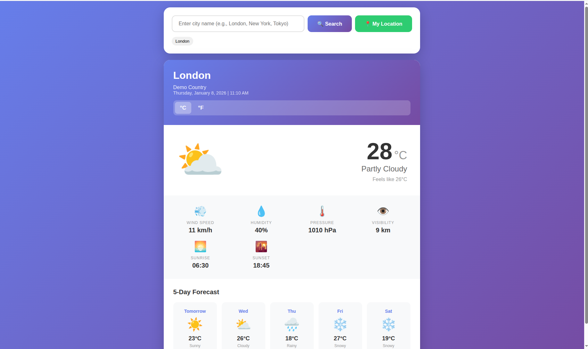
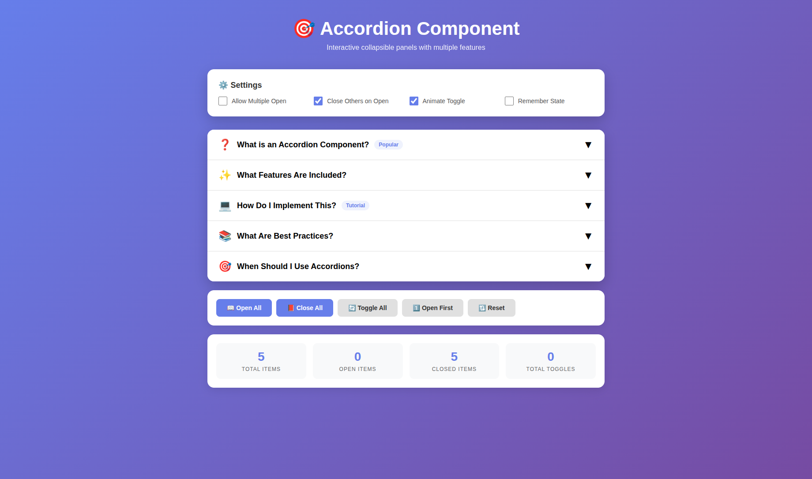

# 📘 Learning JavaScript

---
### What is JavaScript?

JavaScript is a high-level, interpreted programming language used to create interactive, dynamic, and responsive web applications.  

It runs directly in the browser and allows developers to control webpage behavior such as user interactions, data updates, animations, and real-time content changes. 

JavaScript is one of the core web technologies, alongside HTML (structure) and CSS (styling), and is also widely used on the server-side, mobile apps, and desktop applications.

---
### Data Types & Variables

Variables
```
// Three ways to declare variables:
var oldWay = "avoid using var"; // old, function-scoped
let age = 25; // can be reassigned
const name = "Sarah"; // cannot be reassigned

age = 26; // ✓ works
// name = "John"; // ✗ error - can't reassign const
```

Data Types
```
// 1. STRING - text
let greeting = "Hello";
let message = 'Single quotes work too';
let template = `I can include ${greeting} here`; // template literal

// 2. NUMBER - integers and decimals
let integer = 42;
let decimal = 3.14;
let negative = -10;

// 3. BOOLEAN - true or false
let isStudent = true;
let hasGraduated = false;

// 4. UNDEFINED - no value assigned
let notDefined;
console.log(notDefined); // undefined

// 5. NULL - intentionally empty
let emptyValue = null;

// 6. Check types
console.log(typeof greeting); // "string"
console.log(typeof integer); // "number"
```

### Operators & Control Flow

Arithmetic Operators
```
let a = 10;
let b = 3;

console.log(a + b); // 13 (addition)
console.log(a - b); // 7 (subtraction)
console.log(a * b); // 30 (multiplication)
console.log(a / b); // 3.333... (division)
console.log(a % b); // 1 (remainder/modulo)
console.log(a ** b); // 1000 (exponentiation)

// Increment/Decrement
let count = 5;
count++; // count is now 6
count--; // count is now 5
```

Comparison Operators
```
let x = 5;
let y = "5";

console.log(x == y);  // true (loose equality, converts types)
console.log(x === y); // false (strict equality, checks type too)
console.log(x != y);  // false
console.log(x !== y); // true

console.log(x > 3);   // true
console.log(x <= 5);  // true
```

If Statements
```
let temperature = 25;

if (temperature > 30) {
    console.log("It's hot!");
} else if (temperature > 20) {
    console.log("Nice weather!"); // This runs
} else {
    console.log("It's cold!");
}

// Ternary operator (shorthand)
let status = temperature > 25 ? "Warm" : "Cool";
```
Loops
```
// FOR loop - when you know how many times
for (let i = 0; i < 5; i++) {
    console.log(`Count: ${i}`); // 0, 1, 2, 3, 4
}

// WHILE loop - when condition-based
let countdown = 3;
while (countdown > 0) {
    console.log(countdown); // 3, 2, 1
    countdown--;
}

// DO-WHILE - runs at least once
let answer;
do {
    answer = prompt("Enter 'yes':");
} while (answer !== "yes");
```

### Functions

Basic Functions
```
// Function declaration
function greet(name) {
    return `Hello, ${name}!`;
}

console.log(greet("Alex")); // "Hello, Alex!"

// Function with multiple parameters
function add(a, b) {
    return a + b;
}

let sum = add(5, 3); // 8

// Default parameters
function welcome(name = "Guest") {
    return `Welcome, ${name}!`;
}

console.log(welcome()); // "Welcome, Guest!"
console.log(welcome("Sam")); // "Welcome, Sam!"
```

Arrow Functions (Modern Syntax)
```
// Traditional function
function multiply(a, b) {
    return a * b;
}

// Arrow function (shorter)
const multiply = (a, b) => {
    return a * b;
};

// Even shorter (implicit return)
const multiply = (a, b) => a * b;

// Single parameter (no parentheses needed)
const square = x => x * x;

console.log(square(4)); // 16
```

---

## 🎂 Age Calculator
**What You’ll Learn:** Variables & operators, DOM manipulation, Date manipulation & calculations, input validation, dynamic UI updates  

📸 **Screenshot**  


<a href="https://pankajsondagar.github.io/javascript/beginner-projects/age-calculator/" target="_blank" rel="noopener noreferrer">
  🚀 Live Demo
</a>

---

## 🌡️ Temperature Converter
**What You’ll Learn:** Real-time updates, temperature conversion formulas, multiple output handling, Functions, conditionals

📸 **Screenshot**  


<a href="https://pankajsondagar.github.io/javascript/beginner-projects/temperature-converter/" target="_blank" rel="noopener noreferrer">
  🚀 Live Demo
</a>

---

## 💬 Random Quote Generator
**What You’ll Learn:** Data collections, random number generation, duplicate prevention, Arrays & objects, random logic, event handling   

📸 **Screenshot**  


<a href="https://pankajsondagar.github.io/javascript/beginner-projects/quote-generator/" target="_blank" rel="noopener noreferrer">
  🚀 Live Demo
</a>

---

## 🎨 Color Flipper
**What You’ll Learn:** HEX/RGB colors, brightness calculation, dynamic style updates, Random color generation, string manipulation,

📸 **Screenshot**  


<a href="https://pankajsondagar.github.io/javascript/beginner-projects/color-flipper/" target="_blank" rel="noopener noreferrer">
  🚀 Live Demo
</a>

---

## 🔢 Simple Counter 
**What You’ll Learn:** State handling, keyboard & button events, animations, increment/decrement logic, conditional styling 

📸 **Screenshot**  


<a href="https://pankajsondagar.github.io/javascript/beginner-projects/simple-counter/" target="_blank" rel="noopener noreferrer">
  🚀 Live Demo
</a>

---

## ✅ Todo List App
**What You’ll Learn:** Task filtering, persistent state, dynamic rendering, Array manipulation, CRUD operations, state management  

📸 **Screenshot**  


<a href="https://pankajsondagar.github.io/javascript/beginner-projects/todo-list/" target="_blank" rel="noopener noreferrer">
  🚀 Live Demo
</a>

---

---

## 🧠 Intermediate Concepts 

---

## 🎂 Password Generator
**What You’ll Learn:** String manipulation and concatenation, Clipboard API for copying text, DOM manipulation and styling  

📸 **Screenshot**  


<a href="https://pankajsondagar.github.io/javascript/intermediate-projects/password-generator/" target="_blank" rel="noopener noreferrer">
  🚀 Live Demo
</a>

---

## 🎂 Tip Calculator
**What You’ll Learn:** Form Handling, Calculations, State Management, DOM Manipulation, UI Patterns, Money Operations   

📸 **Screenshot**  


<a href="https://pankajsondagar.github.io/javascript/intermediate-projects/tip-calculator/" target="_blank" rel="noopener noreferrer">
  🚀 Live Demo
</a>

---

## 🎂 BMI Calculator
**What You’ll Learn:** Validation, Calculations, Conditionals & Ranges, Data Structures, DOM Manipulation, User Experience

📸 **Screenshot**  


<a href="https://pankajsondagar.github.io/javascript/intermediate-projects/bmi-calculator/" target="_blank" rel="noopener noreferrer">
  🚀 Live Demo
</a>

---

## 🎂 Word Counter
**What You’ll Learn:**  String manipulation in depth, Text parsing and analysis, Real-time DOM updates, Frequency counting algorithms, Regular expressions basics, Array transformation methods

📸 **Screenshot**  


<a href="https://pankajsondagar.github.io/javascript/intermediate-projects/word-counter/" target="_blank" rel="noopener noreferrer">
  🚀 Live Demo
</a>

---

## 🎂 Rock Paper Scissors
**What You’ll Learn:**  Game Logic, Score Management, Data Structures, Advanced Logic, DOM Updates, User Experience   

📸 **Screenshot**  


<a href="https://pankajsondagar.github.io/javascript/intermediate-projects/rock-paper-scissors/" target="_blank" rel="noopener noreferrer">
  🚀 Live Demo
</a>

---

## 🎂 Quiz App
**What You’ll Learn:** Data Structures, Array Methods, Timers, Scoring Systems, State Management, Algorithm Concepts    

📸 **Screenshot**  


<a href="https://pankajsondagar.github.io/javascript/intermediate-projects/quiz-app/" target="_blank" rel="noopener noreferrer">
  🚀 Live Demo
</a>

---

## 🎂 Weather App
**What You’ll Learn:** Asynchronous JavaScript with async/await, Making API requests with fetch, Error handling in async code, Working with real external data, Browser APIs (geolocation, localStorage), Loading and error states, Data transformation and display      

📸 **Screenshot**  


<a href="https://pankajsondagar.github.io/javascript/intermediate-projects/weather-app/" target="_blank" rel="noopener noreferrer">
  🚀 Live Demo
</a>

---

## Accordion Component
**What You’ll Learn:** Show/hide state management, Event handling (clicks, keyboard), Dynamic HTML generation, Overlay patterns and positioning, Accessibility basics

📸 **Screenshot**  


<a href="https://pankajsondagar.github.io/javascript/advanced-projects/accordion-component/" target="_blank" rel="noopener noreferrer">
  🚀 Live Demo
</a>

---